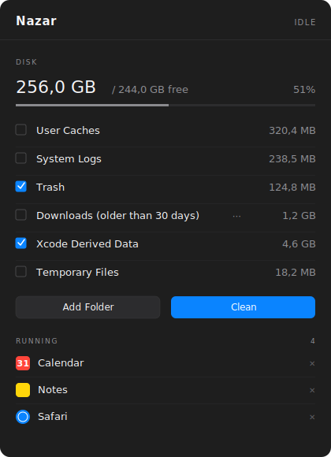
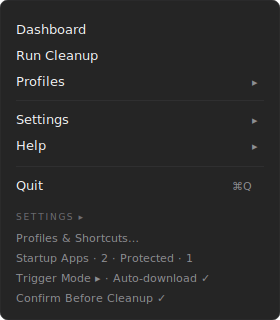
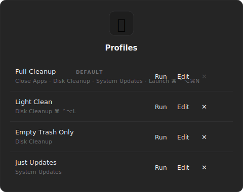
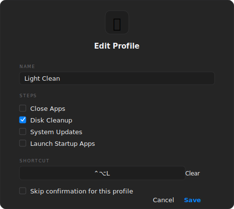

<div align="center">
  

  <h1>Nazar 🧿</h1>

  <p><em>A minimalist macOS menu bar utility that closes apps, cleans caches, empties the Trash, checks for system updates, and relaunches your favorite apps — all in one click.</em></p>

  <p>
    <a href="https://github.com/emircbngl/nazar/actions/workflows/build.yml"></a>
    <a href="LICENSE"></a>
    <a href="#requirements"></a>
    <a href="#"></a>
  </p>

  
</div>

> ⚠️ **Destructive operations**: Nazar deletes files (caches, logs, Trash, temp). Back up before first use. The author is not responsible for data loss.

> ℹ️ All screenshots in this README use **synthetic data**. No personal information is included in this repository.

## Features

- **One-click cleanup** — close all running apps (with a protected-app list), clean user caches, system logs, Trash, Xcode DerivedData, and temp files
- **Profiles & shortcuts** — define multiple cleanup profiles (e.g. "Light Clean", "Empty Trash Only", "Just Updates"), each with its own global hotkey
- **Custom folders** — point Nazar at any folder you want cleaned, with optional age filters (7d, 30d, 90d, 6mo, 1y)
- **System updates** — check for and download macOS updates inline
- **Protected apps** — keep your editor / music player running while everything else closes; "one-time" or "always" protection
- **Trigger modes** — double-tap the icon, double-click, ⌥-click, or long press
- **Dashboard** — see disk usage, running apps, available updates at a glance
- **Localized** — English and Turkish

## Screenshots

<table>
  <tr>
    <td align="center"></td>
    <td align="center"></td>
  </tr>
  <tr>
    <td align="center"><em>Status bar menu</em></td>
    <td align="center"><em>Profiles &amp; Shortcuts</em></td>
  </tr>
  <tr>
    <td colspan="2" align="center"></td>
  </tr>
  <tr>
    <td colspan="2" align="center"><em>Profile editor — name, steps, optional global shortcut</em></td>
  </tr>
</table>

## Privacy

Nazar makes **no network calls**, collects **no telemetry**, and sends **no analytics**. The log file lives only on your machine at:

```
~/Library/Application Support/Nazar/nazar.log
```

You can attach it via **Help → Send Feedback** when reporting issues. The log auto-trims at 256 KB.

## Requirements

- macOS 13.0 or later
- Apple Silicon or Intel

## Install

### Pre-built (recommended)

Download the latest signed & notarized DMG from [Releases](../../releases), open it, and drag Nazar.app to your Applications folder.

### Build from source

```bash
git clone https://github.com/<your-username>/nazar.git
cd nazar
swift build -c release
```

The binary is at `.build/release/Nazar`. To create a launchable app bundle, copy it into `Nazar.app/Contents/MacOS/Nazar` and ad-hoc sign:

```bash
codesign --force --deep --sign - Nazar.app
open Nazar.app
```

## Permissions

On first run Nazar will ask for:

- **Automation (Apple Events)** → to empty the Trash via Finder. Without this, Nazar falls back to direct file deletion.
- **Notifications** → to show the post-cleanup summary.
- **Full Disk Access** (optional) → to clean caches under protected paths. Grant via System Settings → Privacy & Security → Full Disk Access.

Use **Help → Check Permissions…** to verify or open the relevant System Settings pane.

## URL scheme

Nazar registers `nazar://` for automation:

- `nazar://cleanup` — runs the default profile
- `nazar://dashboard` — opens the Dashboard
- `nazar://profiles` — opens Profiles & Shortcuts
- `nazar://feedback` — opens Send Feedback dialog

## Distribution

This app is **not** on the Mac App Store and likely never will be — sandbox restrictions prevent it from terminating other apps, accessing system logs, or running `softwareupdate`/`purge`. Like other Mac utilities in its category (CleanMyMac, OnyX, BetterTouchTool, AppCleaner), Nazar is distributed via Developer ID + notarization.

## Contributing

Issues and pull requests welcome. Please open an issue first to discuss any non-trivial change.

## License

MIT — see [LICENSE](LICENSE).
